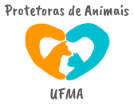

<h1 align="center">
  
</h1>

Site desenvolvido para o terceiro desafio do <a href="https://www.inova.ma.gov.br/trilhas">Programa Trilhas</a>

## Desafio
  
Desenvolver uma landing page para um projeto social maranhense com o intuito de aumentar a divulgação do trabalho desenvolvido.
  
## Site
  

Para o desafio, foi desenvolvida a landing page das Protetora de Animais - UFMA, um grupo voluntário de estudantes da Universidade Federal do Maranhão, que faz resgates, intermediação de adoções, assistência veterinária e distribuição de alimentos para cachorros e gatos que vivem no campus de São Luís. 

Acesse o site em: <a href="https://protetoras-ufma.vercel.app/">https://protetoras-ufma.vercel.app/</a>

Design inspirado no projeto do NLW Origins Six da Rocketseat.
